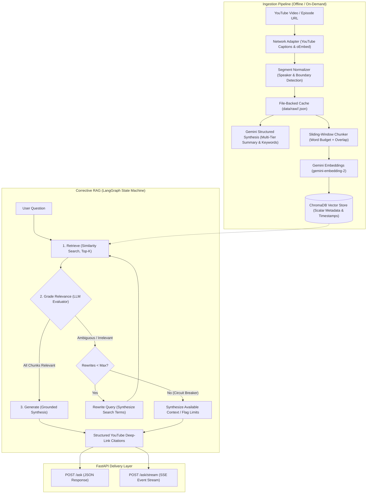
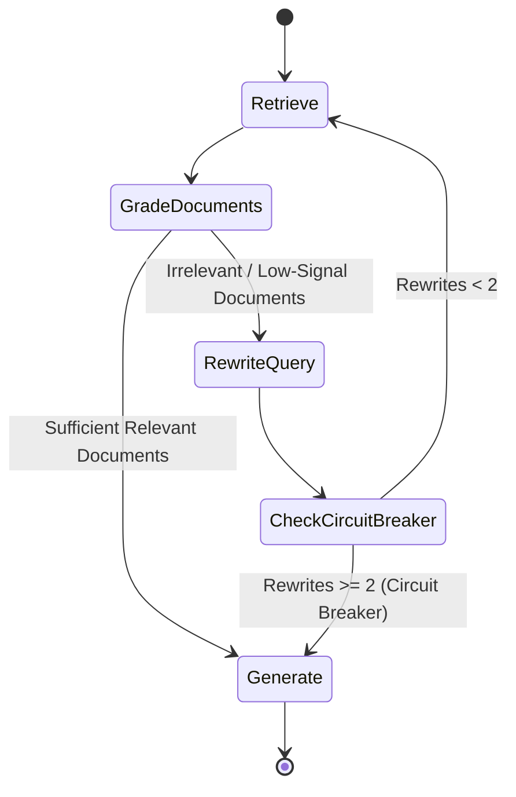

# AskPodcast 🎙️

> An autonomous Corrective RAG (CRAG) system and semantic search engine for long-form podcast transcripts, delivering verifiable answers with exact YouTube timestamp deep-links.

[](https://www.python.org/)
[](https://fastapi.tiangolo.com/)
[](https://langchain-ai.github.io/langgraph/)
[](https://www.trychroma.com/)
[](https://www.docker.com/)
[](https://opensource.org/licenses/MIT)

---

## 🌟 Overview

Conversational audio and podcast transcripts present unique challenges for traditional Retrieval-Augmented Generation (RAG):
1. **Colloquial & Tangential Speech:** Speakers introduce ideas indirectly, using colloquialisms, digressions, and stories that cause naive vector retrieval to pull irrelevant context.
2. **Loss of Temporal Context:** Standard chunkers split transcripts on arbitrary character or token counts, obliterating precise timestamp bounds and speaker transitions.
3. **Hallucination Risk:** When retrieved transcript segments lack complete answers, standard RAG systems hallucinate plausible-sounding explanations rather than acknowledging retrieval gaps.

**AskPodcast** solves these challenges using a **Corrective RAG (CRAG)** state machine orchestrated via **LangGraph**, paired with an **adaptive sliding-window chunking engine** that maintains second-accurate temporal boundaries. Every claim generated by the system includes verified, clickable YouTube deep-link citations (`https://youtu.be/<id>?t=<seconds>`).

---

## 🏗️ Architecture

The system operates across two decoupled pipelines: **Transcript Ingestion & Semantic Indexing** and **Corrective RAG Query Orchestration**.



---

## 🔄 Corrective RAG (CRAG) Workflow

Instead of naively feeding retrieved context directly into an answer generation prompt, the system routes queries through a cyclic state graph with built-in reflection:



- **Relevance Grading:** Each retrieved chunk is evaluated via structured output (`GradeResult: binary_score="yes"|"no"`). Irrelevant chunks are discarded to prevent context contamination.
- **Self-Correction & Query Optimization:** If no retrieved documents pass the relevance threshold, the state machine invokes a query rewriter that extracts the core semantic intent and re-executes retrieval.
- **Circuit Breaker:** A deterministic retry ceiling (`MAX_REWRITES = 2`) prevents infinite routing loops, gracefully degrading to available context if retrieval cannot resolve.

---

## ⚡ Key Technical Features

### 1. Sliding-Window Temporal Chunking
Rather than splitting text by arbitrary tokens, `app/ingestion/chunking.py` implements a windowed chunker that respects transcript structure:
- **Exact Second Boundaries:** Every chunk records its source `start_seconds` and `end_seconds`.
- **Speaker Transition Awareness:** Respects speaker boundaries across guest and host turns.
- **Overlap Budget:** Configurable sliding window (default: 400 words target, 80 words overlap) prevents fragmented thoughts.

### 2. Zero-Cost Incremental Ingestion & Metadata Hierarchy
- Ingestion checks local disk caches before hitting external APIs.
- Generates a rich semantic hierarchy: 2-sentence executive summary, comprehensive synthesis, 4–6 actionable takeaways, and 10–15 topic tags.
- Cached analyses persist back into raw storage, ensuring repeated queries incur zero duplicate LLM cost.

### 3. Real-Time Server-Sent Events (SSE) Streaming
The `POST /ask/stream` endpoint streams the agent's internal reasoning lifecycle in real time:
```text
event: node_start     -> {"node": "retrieve"}
event: node_end       -> {"node": "retrieve", "chunks_retrieved": 5}
event: node_start     -> {"node": "grade_documents"}
event: token          -> Real-time token streaming of final answer
event: citations      -> Array of structured deep-link citations
```

### 4. Pluggable Multi-Provider Architecture & Safe Collection Partitioning
The system abstracts model initialization via `app/factory.py`, making it provider-agnostic across **Google Gemini, OpenAI (GPT-4o), Anthropic (Claude 3.5), xAI (Grok 2), and local Ollama**:
- **Zero-Code Switching:** Toggle providers and model names via `.env` without modifying application code.
- **Dynamic Collection Partitioning:** ChromaDB collections are dynamically derived from the active embedding model (e.g. `podcast_chunks_gemini_embedding_2` vs `podcast_chunks_text_embedding_3_small`). Switching embedding models in `.env` automatically boots an isolated collection, eliminating vector dimension mismatch crashes (`3072` vs `1536` dims).

---

## 🚀 Quickstart

### Prerequisites
- [Docker](https://docs.docker.com/get-docker/) & [Docker Compose](https://docs.docker.com/compose/)
- A [Google Gemini API Key](https://aistudio.google.com/app/apikey)

### Option 1: Docker (Recommended)

1. **Clone the repository:**
   ```bash
   git clone https://github.com/your-username/AskPodcast.git
   cd AskPodcast
   ```

2. **Configure environment variables:**
   ```bash
   cp .env.example .env
   ```
   Add your Gemini API key to `.env`:
   ```env
   GEMINI_API_KEY=your_actual_gemini_api_key
   CHAT_MODEL=gemini-3.8-flash
   EMBEDDING_MODEL=models/gemini-embedding-2
   ```

3. **Start the service:**
   ```bash
   docker compose up --build
   ```
   The API will be live at `http://localhost:8000`. Persistent database storage is automatically mapped to `./chroma_db` and `./data`.

---

### Option 2: Local Python Environment

1. **Create and activate a virtual environment (Python 3.13):**
   ```bash
   python3.13 -m venv .venv
   source .venv/bin/activate
   ```

2. **Install dependencies:**
   ```bash
   pip install -r requirements.txt
   ```

3. **Run unit tests:**
   ```bash
   pytest -v
   ```

4. **Launch development server:**
   ```bash
   uvicorn app.api:app --reload --port 8000
   ```

---

## 📡 API Reference

Interactive OpenAPI documentation is available at `http://localhost:8000/docs`.

### 1. Ingest an Episode
**`POST /ingest`** — Extracts transcripts, synthesizes summaries, and indexes chunks into the vector store.
```bash
curl -X POST http://localhost:8000/ingest \
  -H "Content-Type: application/json" \
  -d '{
    "url_or_id": "https://www.youtube.com/watch?v=QmOF0crdyRU",
    "show": "huberman_lab"
  }'
```

### 2. Query Knowledge Library
**`GET /episodes`** — Lists all currently indexed episodes with multi-tier summaries and keyword tags.
```bash
curl http://localhost:8000/episodes
```

### 3. Ask a Question (Synchronous JSON)
**`POST /ask`** — Runs Corrective RAG workflow and returns answers with timestamp citations.
```bash
curl -X POST http://localhost:8000/ask \
  -H "Content-Type: application/json" \
  -d '{
    "query": "How does morning sunlight affect dopamine and cortisol?",
    "show_filter": "huberman_lab"
  }'
```

**Response:**
```json
{
  "answer": "Viewing bright sunlight within 30-60 minutes of waking triggers an optimal release of cortisol and elevates baseline dopamine levels throughout the day [1].",
  "citations": [
    {
      "source": "QmOF0crdyRU",
      "episode_title": "Controlling Your Dopamine For Motivation, Focus & Satisfaction",
      "start_seconds": 1245.0,
      "end_seconds": 1390.0,
      "timestamp_display": "00:20:45",
      "url": "https://youtu.be/QmOF0crdyRU?t=1245",
      "quote": "When you view sunlight in the early part of the day, you set a timer on cortisol release..."
    }
  ],
  "rewrites_used": 0
}
```

### 4. Stream Answers (Server-Sent Events)
**`POST /ask/stream`** — Stream reasoning steps and answer generation in real time.
```bash
curl -N -X POST http://localhost:8000/ask/stream \
  -H "Content-Type: application/json" \
  -d '{
    "query": "What is the relationship between cold exposure and dopamine?"
  }'
```

---

## 🧪 Testing

The test suite validates data schemas, YouTube parsing adapters, sliding-window chunking algorithms, graph routing logic, and HTTP endpoints with 100% offline mocks:

```bash
pytest -v
```

---

## 📂 Project Structure

```text
AskPodcast/
├── app/
│   ├── api/                   # FastAPI routing, app factory, & SSE handlers
│   │   ├── __init__.py
│   │   └── routes.py
│   ├── agent/                 # LangGraph Corrective RAG workflow
│   │   ├── state.py           # TypedDict AgentState
│   │   ├── nodes.py           # retrieve, grade, rewrite, generate nodes
│   │   └── graph.py           # Compiled state graph & routing edges
│   ├── ingestion/             # Transcript transformation pipeline
│   │   ├── chunking.py        # Sliding-window chunker with timestamp boundaries
│   │   └── youtube.py         # YouTube transcript fetcher & text normalizer
│   ├── schemas/               # Pydantic v2 data contracts
│   │   ├── api.py             # AskRequest, AskResponse, IngestRequest, Citation
│   │   └── transcripts.py     # Segment, Chunk, Show data definitions
│   └── vectorstore.py         # ChromaDB client & Gemini embeddings wrapper
├── scripts/
│   ├── ask_agent.py           # Interactive CLI runner for the agent
│   ├── fetch_episode.py       # Standalone episode downloader & cacher
│   └── index_and_search.py    # Standalone vector indexing & retrieval script
├── tests/                     # Comprehensive offline test suite
├── Dockerfile                 # Slim, multi-stage, non-root container image
├── docker-compose.yml         # Container orchestration with volume persistence
└── pyproject.toml             # Pytest & development toolchain configuration
```

---

## 📄 License

Distributed under the MIT License. See `LICENSE` for more information.
